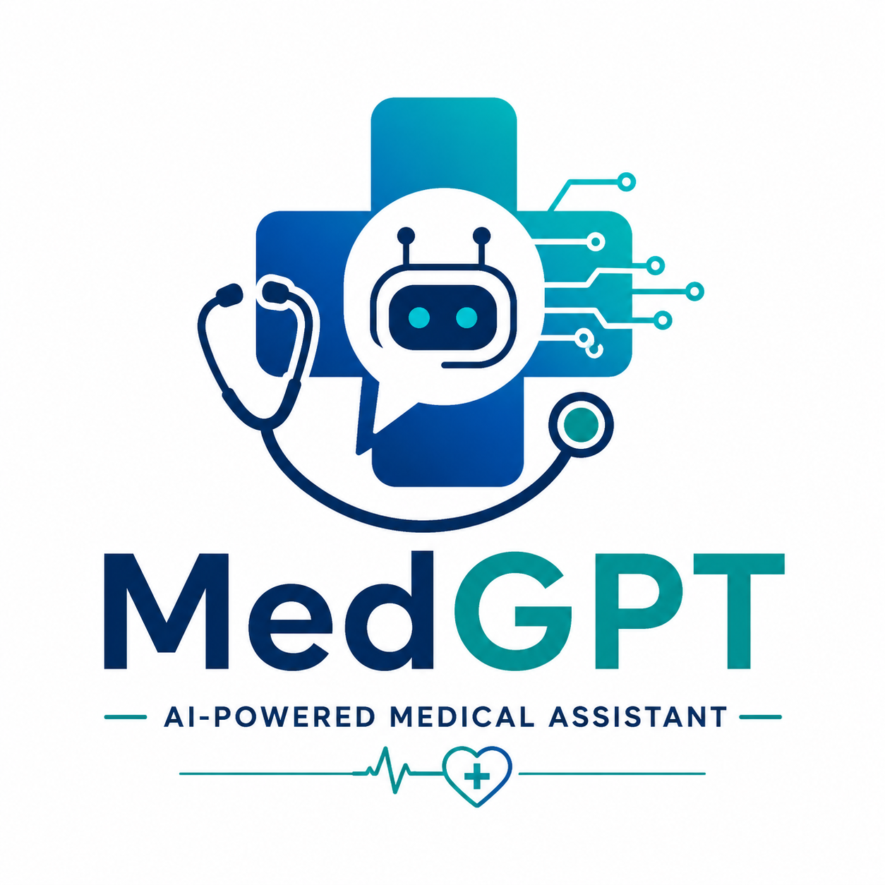
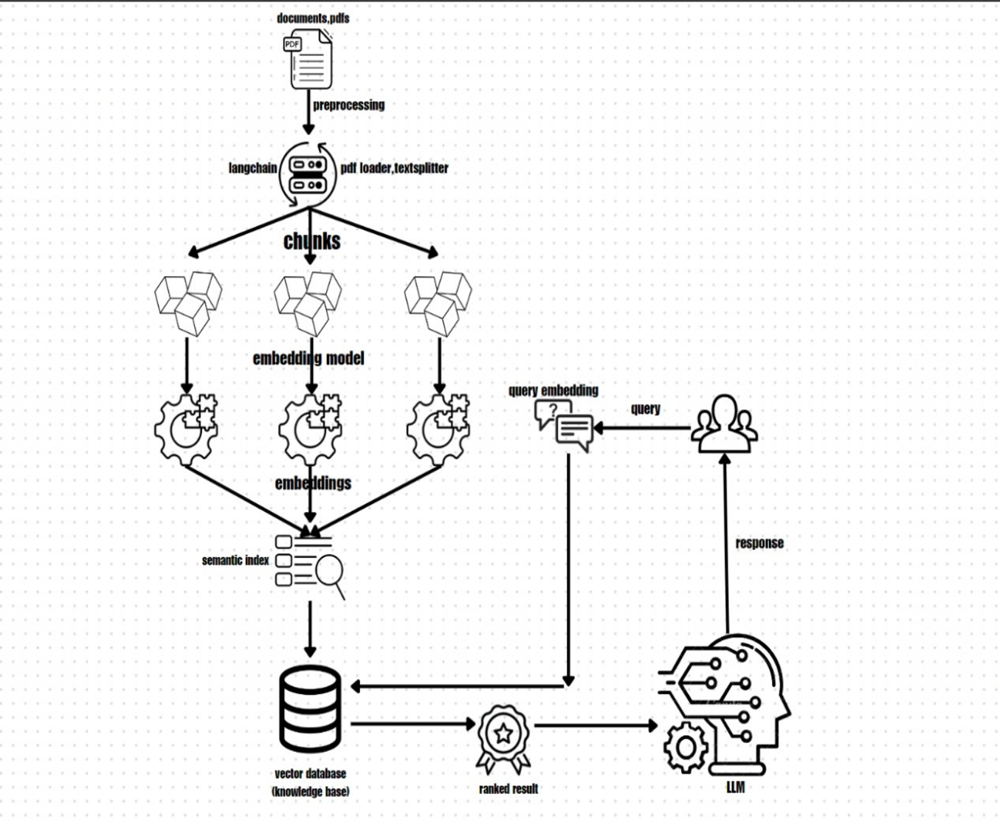
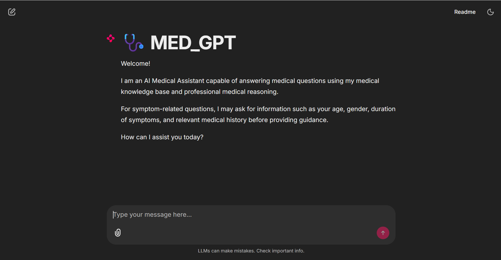
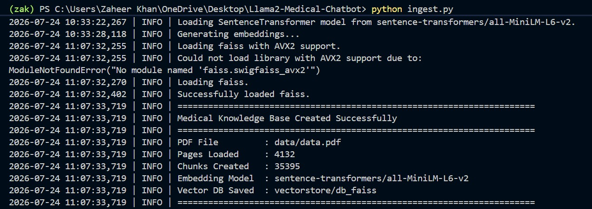

<p align="center">
  
</p>

<h1 align="center">🩺 MedGPT</h1>

<p align="center">
An AI-powered Medical Assistant powered by <b>Retrieval-Augmented Generation (RAG)</b>, LangChain, FAISS, Hugging Face Embeddings, and Groq's Llama 3.1.
</p>

<p align="center">


</p>

---

# 📖 Overview

**MedGPT** is an AI-powered Medical Assistant that combines **Retrieval-Augmented Generation (RAG)** with Large Language Models (LLMs) to provide accurate, context-aware, and evidence-based responses to medical questions.

Unlike traditional chatbots that rely solely on an LLM's internal knowledge, MedGPT first retrieves relevant information from a curated medical knowledge base using semantic search. The retrieved medical context is then supplied to the language model, significantly improving response quality while reducing hallucinations.

> **Disclaimer**
>
> This project is intended for educational and research purposes only. It should **not** be considered a substitute for professional medical advice, diagnosis, or treatment.

---

# ✨ Features

- 🩺 AI-powered Medical Question Answering
- 📚 Retrieval-Augmented Generation (RAG)
- 📄 Medical PDF Knowledge Base Processing
- 🔍 Semantic Search using FAISS
- 🤖 Groq Llama 3.1 Integration
- 💬 Interactive Chat Interface using Chainlit
- 🧠 Hugging Face Sentence Transformer Embeddings
- ⚡ Fast AI Inference
- 📑 Context-aware Medical Assistance

---

# 🏗️ System Architecture

<p align="center">

</p>

## Workflow

1. Medical reference documents are loaded.
2. Documents are split into semantic chunks.
3. Sentence Transformers generate vector embeddings.
4. FAISS stores embeddings inside a vector database.
5. The user submits a medical question.
6. The query is converted into an embedding.
7. Similar medical chunks are retrieved.
8. Retrieved context is combined with the prompt.
9. Groq's Llama 3.1 generates the final response.

---

# 📸 Application Preview

## Home Screen

<p align="center">

</p>


# 🛠️ Technology Stack

| Category | Technology |
|-----------|------------|
| Programming Language | Python |
| Framework | LangChain |
| User Interface | Chainlit |
| Large Language Model | Groq Llama 3.1 |
| Embeddings | Hugging Face Sentence Transformers |
| Vector Database | FAISS |
| PDF Processing | PyMuPDF |
| Prompt Engineering | LangChain PromptTemplate |

---

# 📂 Project Structure

```text
MedGPT/
│
├── assets/
│   ├── logo.png
│   ├── architecture.png
│   ├── homepage.png
│   └── chat.png
│
├── data/
│   └── README.md
│
├── vectorstore/
│   └── .gitkeep
│
├── app.py
├── ingest.py
├── requirements.txt
├── README.md
├── LICENSE
├── .env.example
└── .gitignore
```

---

# ⚙️ Installation

## 1. Clone the Repository

```bash
git clone https://github.com/Mdzak09/MED-GPT.git

cd MED-GPT
```

---

## 2. Create a Virtual Environment

```bash
python -m venv .venv
```

### Windows

```bash
.venv\Scripts\activate
```

### Linux/macOS

```bash
source .venv/bin/activate
```

---

## 3. Install Dependencies

```bash
pip install -r requirements.txt
```

---

# 🔑 Environment Variables

Create a `.env` file in the project root.

```env
GROQ_API_KEY=YOUR_GROQ_API_KEY
```

---

# 📄 Build the Medical Knowledge Base

MedGPT uses **Retrieval-Augmented Generation (RAG)** and requires a medical reference PDF to build the vector database.

> **Important**
>
> The medical reference PDF is **NOT included** in this repository due to copyright restrictions.

This project was developed and tested using:

> **Harrison's Principles of Internal Medicine**

Link for pdf data:
https://drive.google.com/drive/folders/1po63CPRsdac7OL-53DuKOyYxHj79Ddv1?usp=sharing

---

## Step 1

Place the medical reference PDF inside the **data** directory and rename it as:

```text
data/
└── data.pdf
```

---

## Step 2

Generate the FAISS vector database.

```bash
python ingest.py
```

The ingestion pipeline performs the following operations:

- Loads the medical PDF
- Splits the document into semantic chunks
- Generates embeddings using Sentence Transformers
- Builds a FAISS vector database

---

## Typical Output
<p align="center">

</p>

When using **Harrison's Principles of Internal Medicine**, the ingestion process typically generates approximately:

| Metric | Value |
|---------|-------|
| Pages Loaded | ~4,132 |
| Semantic Chunks | ~35,395 |
| Embedding Model | sentence-transformers/all-MiniLM-L6-v2 |

> **Note**
>
> Building the vector database is computationally intensive and may take **10–30 minutes**, depending on your CPU, RAM, and storage performance, since embeddings must be generated for thousands of document chunks.

After completion, the generated FAISS index will be stored inside:

```text
vectorstore/db_faiss/
```

---

# 🚀 Run MedGPT

Start the Chainlit application:

```bash
chainlit run model.py
```

Open your browser:

```
http://localhost:8000
```

You can now begin interacting with MedGPT.

---

# 🌟 Why MedGPT?

Traditional chatbots rely entirely on a Large Language Model's internal knowledge, which can sometimes lead to inaccurate or hallucinated responses.

MedGPT enhances response quality by first retrieving the most relevant medical information from a curated knowledge base using semantic search. The retrieved context is then supplied to the language model before generating the final answer, resulting in more reliable, evidence-based, and context-aware medical responses.

---

# 📈 Future Improvements

- 🎙️ Voice-based Medical Consultation
- 📷 Medical Image Analysis
- 💊 Drug Interaction Detection
- 🧠 Long-term Conversation Memory
- 👤 Patient Authentication
- 🌐 Multi-language Support
- 🏥 Electronic Health Record (EHR) Integration
- 🔄 FHIR Healthcare Interoperability
- 📊 Medical Report Summarization
- 📱 Mobile Application Support

---

# 🤝 Contributing

Contributions are welcome!

1. Fork this repository.
2. Create a feature branch.

```bash
git checkout -b feature-name
```

3. Commit your changes.

```bash
git commit -m "Add new feature"
```

4. Push to your branch.

```bash
git push origin feature-name
```

5. Open a Pull Request.

---


# 👨‍💻 Author

**Md Zaheer Ahmed Khan**

- GitHub: https://github.com/Mdzak09
- LinkedIn: https://www.linkedin.com/in/YOUR-LINKEDIN-USERNAME/

---

<p align="center">

⭐ If you found this project useful, consider giving it a Star on GitHub!

</p>